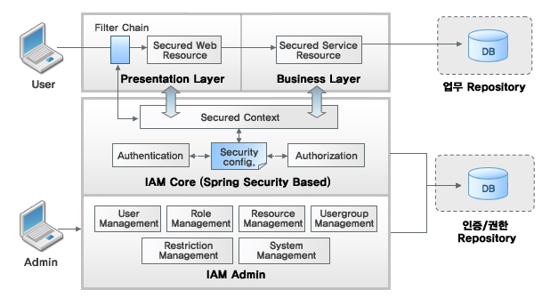

Anyframe IAM
====
IAM은 Spring Security 를 기반으로 Java EE 기반의 엔터프라이즈 어플리케이션을 위한 사용자 인증 및 권한관리 기능을 제공하는 Identity & Access Management Framework 이다. Anyframe 또는 Spring Framework 기반으로 작성된 어플리케이션에 대한 인증 및 권한관리 기능을 제공하며, 사용자 인증 및 권한관리에 능동적이고 유연한 형태의 어플리케이션을 개발할 수 있도록 지원한다.

## 특징
IAM은 다음과 같은 특징을 가진다.

* **Spring Security 기반 IAM Core**: 엔터프라이즈 어플리케이션에 설치되어 사용자 인증 및 권한관리를 제어하는 IAM Core 는 Spring Security 기반으로 작성되어 있으며, DB 기반으로 구축된다. Anyframe 또는 Spring 기반의 어플리케이션에 적용시 기존 어플리케이션의 변경 영향을 최소할 수 있다.
* **독립적인 형태의 IAM Admin Console**: IAM Core 의 동작은 DB의 데이타를 기반으로 하여 구성되며, 이때 DB의 내용을 관리하기 위한 툴이 IAM Admin Console이다. 기존 엔터프라이즈 어플리케이션과 별도로 동작하므로 어플리케이션과의 독립적인 형태로 관리 기능을 구성할 수 있다.
* **Spring Security 의 강력한 기능을 계승**: Spring Security 의 강력한 기능을 계승하고 확장하였으며, 유연하고 확장성 있는 형태의 사용자 인증 및 권한관리 기능을 제공한다.
* **Cross Browser 지원**: IAM Admin 은 Cross Browser 지원하여 Internet Explorer 뿐만 아니라 Firefox, Chrome, Safari 등과 같은 브라우저에서도 동일하게 동작하도록 구현되어 있다.
* **관심 영역의 분리**: Servlet Filter 와 AOP를 통한 가로채기(Interception)을 사용하여 보안을 부여하며, Spring 의 Ioc와 Lifecycle서비스 기반으로 동작하여 일반적인 업무 코드 영역과 분리되어 동작한다.

## 주요기능

### IAM Core
IAM Core 는 Spring Security 을 기반으로 하고 있으며, Anyframe 또는 Spring 기반의 비지니스 어플리케이션에 설치되어 기존 업무 코드의 변경을 최소화 화면서 사용자 인증 및 권한관리 기능을 추가할 수 있다. 특히 DB 기반으로 확장된 설정 정보를 바탕으로 동작한다는 점에서, 기존의 XML 방식으로 설정 정보를 저장하는 Spring Security 와 차이점을 지니고 있다.

#### Service Layer 및 사용자 정의 리소스 보안
일반적으로 권한 체크는 웹 리퀘스트에 제어를 의미한다. IAM Core 는 웹 리퀘스트에 대한 제어 뿐만 아니라 서비스 레이어 및 사용자 정의 리소스에 대한 권한 제어를 통해 보안을 처리할 수 있다.

#### Database 기반의 설정
IAM Core 의 기반이 되는 Spring Security 는 기본적으로 XML 기반의 설정을 통해 보안 설정을 통제한다. Anyframe의 IAM Core 는 일반적으로 널리 사용되는 DB 기반의 설정을 지원함으로써 XML 방식보다 보편적이며, 간단하고 유연한 방식으로 보안 관련 설정을 제어할 수 있다.

### IAM Admin
IAM Core 동작의 기반이 되는 Database 설정을 관리하기 위한 IAM Admin 웹 어플리케이션을 제공한다. IAM Admin은 jQuery, SpringMVC, HibernateJPA 등의 기술 요소를 기반으로 하여 구축되어 있으며, 관리자 권한을 가진 사용자는 IAM Admin 의 UI 에서 제공되는 기능들을 통하여 DB 기반의 보안 설정을 조작하고 제어할 수 있다.

#### 타겟 어플리케이션 권한 리로드
IAM Admin 상에서 변경된 권한 정보는 명시적으로 권한 리로드를 요청하기 전까지는 반영되지 않으며, 관리자가 권한 변경 작업을 종료한 이후 권한 리로드 기능을 수행하면 타켓 어플리케이션(일반적으로 업무 어플리케이션) 의 권한 정보가 갱신된다. 이때 클러스터링 된 서버 환경하에서도 권한 리로드가 가능하다.

#### 타겟 어플리케이션 정보 수집
타겟 어플리케이션은 유지보수를 반복하면서 새로운 기능들이 추가되거나 변경이 될 것이다. IAM Admin 에서는 보호된 자원 등록을 손쉽게 할 수 있도록 타겟 어플리케이션의 정보를 수집하는 기능을 제공한다.

#### 시간 제한에 의한 권한 관리
IAM Admin 에서는 특정 리소스나 역할에 대한 허용 시간 범위를 설정한 다음, 해당 시간동안 자원에 대한 접근, 역할에 대한 접근을 제어할 수 있으며, 이러한 규칙에 예외되는(접근이 허용된 관리자 등) 역할도 정의할 수 있다.

#### Auto Complete 지원
권한 관리를 위하여 타겟 어플리케이션의 보호된 자원을 등록하는 것은 복잡하고 어려운 작업이다. IAM Admin 은 자동 완성 기능을 이용해 이미 추출되어 있는 타겟 어플리케이션의 정보를 기반으로 힌트를 제공하여 사용자가 좀 더 손쉽게 보호된 자원을 등록할 수 있도록 지원한다.

## Quick Start

### 설치 환경
Anyframe IAM 은 아래와 같은 환경에서 동작 가능하도록 개발되었다.

* JDK 1.5 이상
* Application Server - Tomcat 5.5 이상, JEUS 5 이상(JEUS 6 인 경우 fix5 이상), WebLogic 9.2 이상

본 문서에서는 기본적으로 Tomcat6.0을 기준으로 설치 가이드를 진행할 것이다. 이하 문서에서 [Tomcat Home] 이라함은 Tomcat 서버 설치 폴더를 지칭한다.

### 설치
Anyframe IAM Admin 은 별도의 웹 어플리케이션 형태로 동작하며, 보안적용을 위한 IAM Sample 어플리케이션과 함께 쉽게 확인이 가능토록 WAR 형태로 패키징하여 배포하고 있다. IAM Sample 어플리케이션 내에는 Spring Security 기반의 보안 기능을 확장한 IAM Core 가 jar 형태로 탑재되어 있음에 유의한다.
다운 받은 Anyframe-iam-1.1.3-bin.zip 압축을 해제하면 anyframe-iam-admin-web-1.1.3.war, anyframe-iam-sample-1.1.3.war 가 있다. 아래의 예시에서는 Tomcat의 자동 배포를 이용할 것이기 때문에 war 파일명이 web app의 context 루트가 될 것이다. 좀 더 간결한 context root 를 위해서 war 파일명 뒤쪽의 버전 명은 빼고 다음의 예제를 진행 하도록 한다.

1. [Tomcat Home]\webapps 폴더 하위에 앞서 위에서 압축 해제한 anyframe-iam-admin-web.war 파일(Anyframe IAM Admin)을 옮겨 놓는다.
2. [Tomcat Home]\webapps 폴더 하위에 앞서 위에서 압축 해제한 anyframe-iam-sample.war 파일(IAM Sample 어플리케이션)을 옮겨 놓는다.
3. Tomcat 서버 구동에 앞서 Anyframe-iam-1.1.3-bin.zip 압축 해제로 생성된 db/hsqldb 디렉토리의 start.cmd 를 실행하여 HsqlDB 를 서버모드로 기동한다.
4. [Tomcat Home]\bin 디렉토리에서 컴맨트창을 열어 catalina run 을 실행하여 Tomcat 서버를 시작시킨다. Tomcat 서버를 동작시키면 위 [Tomcat Home]\webapps 와 동일한 위치에 WAR 파일이 자동으로 풀리며 2개의 웹 어플리케이션이 한번에 구동될 것이다.

이외의 어플리케이션 서버에 대해서는 각 어플리케이션 서버 배포 방법에 맞게 다운로드한 WAR 파일을 배포하면 된다.

### 실행 확인
정상적으로 실행되었는지 확인하는 방법에 대해 알아보도록 하자.

1. Tomcat 서버가 정상적으로 시작되었는지 콘솔창을 통해 확인한다.
2. 브라우저 주소창에 http://localhost:8080/anyframe-iam-admin-web 을 입력하고, Anyframe IAM Admin 화면이 뜨는지 확인한다.
3. 브라우저 주소창에 http://localhost:8080/anyframe-iam-sample 을 입력하고, IAM Sample 어플리케이션 화면이 뜨는지 확인한다.
4. IAM Admin 로그인 창에서 관리자 계정인 admin / admin123 으로 로그인하여 User / Roles /Resource / Restricttion /System Management 기능들이 잘 동작하는지 확인한다.
5. IAM Sample 어플리케이션 로그인 창에서 일반 사용자 계정인 user / user 로 로그인하여 User, Category, Product 의 리스트 페이지와 상세 페이지 조회가 가능함을 확인한다. Product List 화면의 Export options 가 화면에 표시됨을 확인 한다. 다른 기능에 대해서는 권한처리로 제한되어 있다.
6. 로그아웃 후 로그인 창에서 manager / manager 로 로그인하여 위 사용자에 비하여 Product 메뉴의 CRUD 가 가능함을 확인한다. Category List 화면의 Export options 가 화면에 표시됨을 확인 한다.
7. 로그아웃 후 로그인 창에서 admin / admin123 으로 로그인하여 위 사용자들에 비하여 모든 처리가 가능함을 확인한다. User List 화면의 Export options 가 화면에 표시됨을 확인 한다.

이외, Anyframe IAM 에 대한 자세한 사용법은 Anyframe IAM 매뉴얼을 참고하도록 한다.

### 리소스
IAM에서 사용하고 있는 주요 오픈소스는 다음과 같다.

* [jQuery](http://jquery.com/)
* [jqGrid Plugin](http://www.trirand.com/blog/)
* [jsTree Plugin](http://www.jstree.com/)
* [Spring Security](http://static.springsource.org/spring-security/site/index.html)
* [Spring-Json](http://spring-json.sourceforge.net/)
* [Hibernate](http://www.hibernate.org/)

